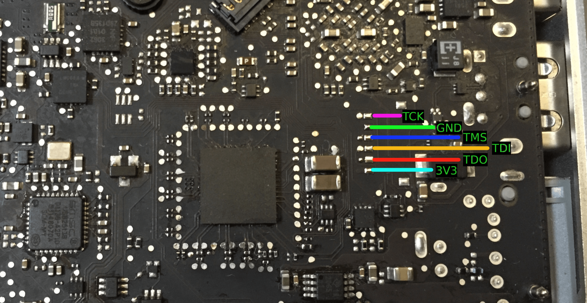
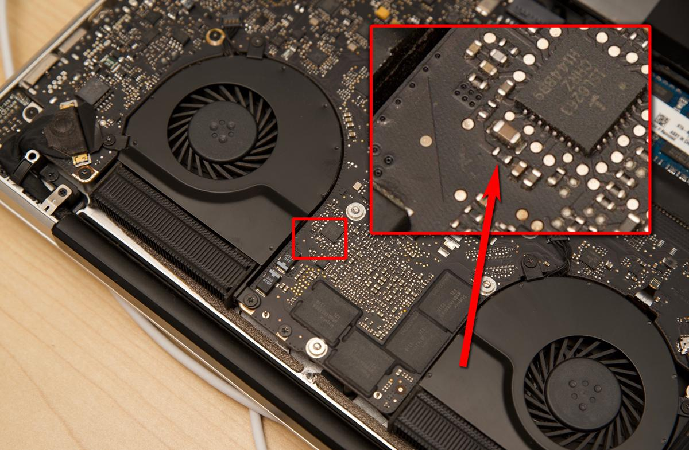
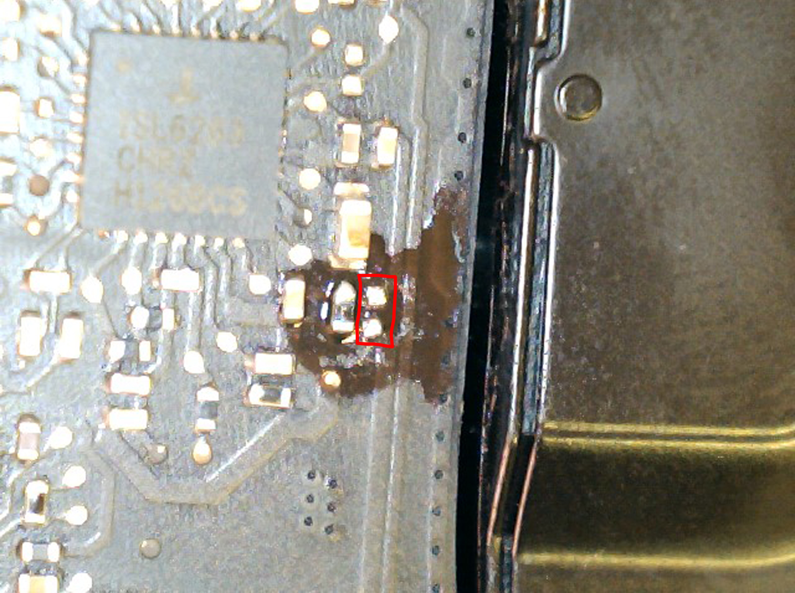

# Macbook Pro 8,2 Resources
Self-made documentation and experiments on the Macbook Pro 8,2 (2011).

As it was the best laptop I've ever owned, I've spent hours trying to learn and tinker as much as possible, this is the result of that: random quirks, documentation and information.

## Issues and mods

### Failing GPUs
Both the 15 inch and 17 inch models are prone to GPU failure.

From research into all the boards I've gone through, I have reason to believe that the issue is limited to later iterations of the machines. This *may* be related to:

- the switch from Samsung VRAM to Hynix VRAM
- a GPU die revision
- other board layout changes

It is difficult to know more; all boards I own, even those with a working GPU have been flashed with a GPU disabler and I never tried to restore the gpu switching functionality.
That said, I found a JED dump ([`A1286_Ogrinal_GPU.rar`](./A1286_Ogrinal_GPU.rar)) that can be used to restore it, I included it in the repository.

I've found a free solution which doesn't rely on the GPU at all, on a russian forum: [`GMUX_gmux.rar`](./GMUX_gmux.rar) which is flashed using `Diamond.exe` and the appropriate Lattice JTAG programmer, using the pinout included:

> [!WARNING]
> After this file is flashed, your brightness controls will no longer work (they are connected to the dGPU exclusively).
> 
> The only way to restore this functionality is to connect the relevant line to a PCH pin which can be done by desoldering it and connecting to a ball or by scraping off the solder mask at the right spot on the PCH chip.
>
> The Thunderbolt 2/MiniDP port is directly connected to the dGPU and cannot be easily rerouted.

#### JTAG hookups for the 15 inch:

#### JTAG hookups for the 17 inch:

> [!IMPORTANT]
> After flashing the MUX, it is heavily reccomended to disable the dGPU vcore by removing the 0ohm resistor below.

#### GPU Vcore disable mod for the 15 inch:

#### GPU Vcore disable mod for the 17 inch:

It will force the MUX to only ever connect the screen to the iGPU and never reroute to the dGPU. As such, even with a dead dGPU, the laptop will still have display output.

### Weird SATA controller issues
Dead SATA controlers, an issue that lies with the PCH: early Sandy Bridge PCHs have an issue where the SATA controller might just give up and die.

Not many should be around as they came with the earlier GPU implementation (who's GPU should be much more reliable, ironically). Fixing this issue requires a PCH swap, and I have not tried it.

It is worth noting that it is quite weird and I've only had 1 board with this issue.

### RAM issues
RAM slots can fail in a very commonly reported manner, though this is not very common compared to 13 inch models of the era.

If lucky, all that needs to be done is reflowing the THT pads, but if you're unlucky, the contact broke elsewhere, which is very difficult to fix, as it is not necessairly visually obvious where the RAM line is interrupted. As such, it can turn into a board that's too broken to be saved, but it might be easy to fix.

### Coreboot
I wanted to see how far I could push the RAM frequency and decided to port over coreboot (see: https://github.com/paranoidnela/coreboot-macbookpro8-x).

As the stock firmware hardcodes the dGPU in legacy mode emulation, Coreboot is a great choice for end users who want to run Windows on these machines, most drivers can be installed by running `bootcamp.msi` under a *admin* cmd noting that some hardware like the trackpad work best using third party drivers such as imbushuo's `mac-precision-touchpad` (see: https://github.com/imbushuo/mac-precision-touchpad)

Coreboot has also helped me troubleshoot dead boards due to flash logging capabilities in coreboot. It's worth noting that this approach is also handy for other machines like Macbook Airs of this era.

If you're curious, I've written a blog post where this kind of use helped me with debug: https://nela.moe/blog/bgawork.html

- Useful command: `cbfstool dump.bin read -r CONSOLE -f console.log`
- Relevant config: `SPI Flash console output`

## Blobs
I'm dumping [blobs](./blobs/) here alongside configs I could find for coreboot use, in hopes that they may be useful to someone. I don't remember their origins, but I do remember that either this machine or the macbook air 4,2 requires a different VGA rom than you may expect, sadly I don't remember the details.

### Stock Firmware
Modding stock firmware is pretty easy, the usual Apple steps need to be taken, but they are decently documented online.

> [!IMPORTANT]
> You cannot just hexedit the full rom or improperly extracted segments with `uefitool` and expect it to work.
> You need to rebuild them so that the contents match the checksums. This can be very handy to edit SPD configs in Macbook Airs.

As for firmware passwords, getting rid of them is pretty easy, and they're only on the firmware ROM. I do not wish to go into detail due to ethical concerns, but if your cause is morally just, you can find a solution by looking it up.

## Credits
Thank you to the coreboot team and Evgeny Zinoviev for the bases to work of off, both with the `macbookair4_2` and `macbookpro8_1` sources, without whom this wouldn't have been easy, as they were of great help for getting the bigger models to work.

Here are the sources for files included:
- `A1286_Ogrinal_GPU.rar` https://www.badcaps.net/forum/troubleshooting-hardware-devices-and-electronics-theory/troubleshooting-laptops-tablets-and-mobile-devices/bios-requests-only/93659-820-2850-gmux-orignal-backup  
- `GMUX_gmux.rar` https://ascnb1.ru/forma1/viewtopic.php?f=33&t=142134 file at: https://ascnb1.ru/forma1/download/file.php?id=64503  
- `15in-min.png`, `17in-min.png` https://forums.macrumors.com/threads/permanently-disable-2011-15-17-macbook-pro-dedicated-gpu-gmux-ic-bypass.2134019/post-28937805  
- `resistor-gpu-radeon-macbook-pro-highlight.jpg` https://www.jeffgeerling.com/sites/default/files/images/resistor-gpu-radeon-macbook-pro-highlight.jpg  
- `82017.jpg` https://realmacmods.com/macbook-2011-radeon-gpu-disable/ file at: https://realmacmods.com/wp-content/uploads/2017/08/82017.jpg
